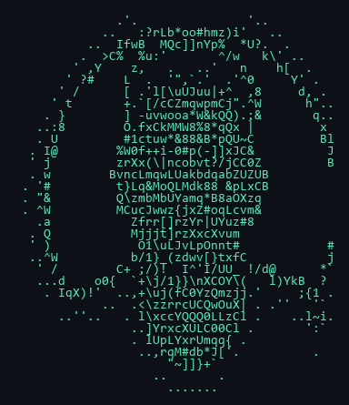

<!--
  Neofetch-style GitHub profile README
  Inspired by terminal system-info layouts
-->

<table>
<tr>
<td width="420" valign="top">



</td>
<td valign="top">

```text
hgus@weldeyowhanes
------------------
OS ............... Windows · Linux · always shipping
Uptime ........... CS & Engineering graduate
Host ............. Addis Ababa, Ethiopia
Kernel ........... Python · Django · Applied ML
Shell ............ PowerShell · Bash · VS Code / Cursor
IDE .............. Cursor · VS Code · Jupyter

Languages.Prog ... Python, JavaScript, SQL, C++, Shell
Languages.Web .... HTML, CSS, JSON, REST
Languages.Real ... English, Tigrinya, Amharic

Hobbies.Soft ..... Backend APIs · ML systems · automation
Hobbies.Hard ..... Homelab ideas · clean architecture

Contact
  Email .......... hgusha2010@gmail.com
  LinkedIn ....... linkedin.com/in/hgus-weldeyowhanes
  GitHub ......... github.com/hgusweldeyowhanes

GitHub Stats
  Repos .......... github.com/hgusweldeyowhanes?tab=repositories
  Focus .......... Backend · AI/ML · production APIs
  Open to ........ Full-time · internship · freelance
```

</td>
</tr>
</table>

---

### `$ whoami`

Backend & applied-ML engineer building **useful systems** — Django APIs, real-time services, and ML that ships beyond notebooks.

---

### `$ ls ~/projects`

| Project | Stack | What |
|---------|-------|------|
| [realtime-chat-service](https://github.com/hgusweldeyowhanes/realtime-chat-service) | Django · Channels · gRPC · Docker | Real-time chat + presence |
| [diabetes-risk-prediction](https://github.com/hgusweldeyowhanes/diabetes-risk-prediction) | Django · scikit-learn · React | Clinical risk scoring |
| [ecomerce-platform](https://github.com/hgusweldeyowhanes/ecomerce-platform) | DRF · JWT · Stripe/Chapa | Catalog · cart · checkout |
| [Face-Recognition-Attendance](https://github.com/hgusweldeyowhanes/Face-Recognition-Attendance) | Flask · OpenCV · face_recognition | Classroom attendance |
| [website-Phishing-detector](https://github.com/hgusweldeyowhanes/website-Phishing-detector) | Python · ML | Suspicious URL classification |
| [portfolio](https://github.com/hgusweldeyowhanes/portfolio) | HTML · CSS | Personal site |

---

### `$ neofetch --skills`

```text
[██████████░░░░░░░░░░] Python / Django / DRF
[█████████░░░░░░░░░░░] ML · pandas · scikit-learn
[████████░░░░░░░░░░░░] Docker · PostgreSQL · Redis
[███████░░░░░░░░░░░░░] WebSockets · Celery · React
[██████░░░░░░░░░░░░░░] Testing · Git · Docs
```

<p align="left">
  
  
  
  
  
  
</p>

---

### `$ cat ~/certs.txt`

- [Machine Learning Specialization](https://www.coursera.org/account/accomplishments/specialization/OWIF2SLE79NP) — Stanford Online / DeepLearning.AI  
- [Supervised Machine Learning](https://www.coursera.org/account/accomplishments/verify/8R9UZSEY8NAU) — Stanford Online / DeepLearning.AI  
- [Advanced Learning Algorithms](https://www.coursera.org/account/accomplishments/verify/MJDYEU0CQ1YK) — DeepLearning.AI  
- [Introduction to Data Engineering](https://www.coursera.org/account/accomplishments/verify/2SP9GQANYNVH) — IBM  
- [CCNA: Introduction to Networks](https://www.credly.com/badges/2f458795-8370-43e8-8db4-57f69b702dae) — Cisco  

---

### `$ git stats`

<div align="center">


[](https://git.io/streak-stats)

[](https://github.com/hgusweldeyowhanes)

</div>

---

```text
$ echo "Open to backend · ML engineering · full-stack Python roles"
Open to backend · ML engineering · full-stack Python roles

$ mail hgusha2010@gmail.com
Subject: Let's build something useful.
```
